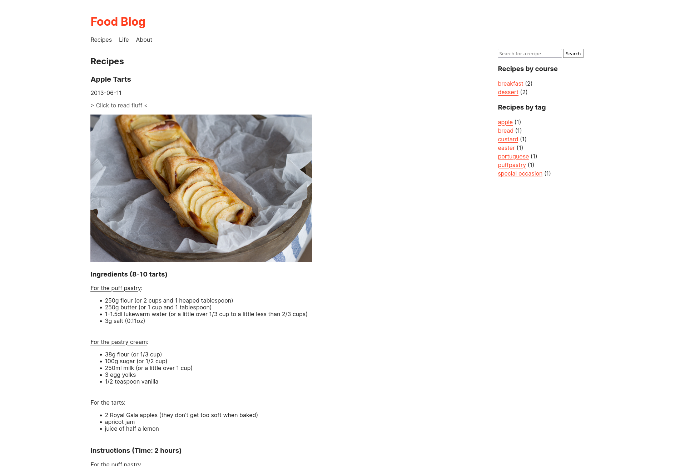
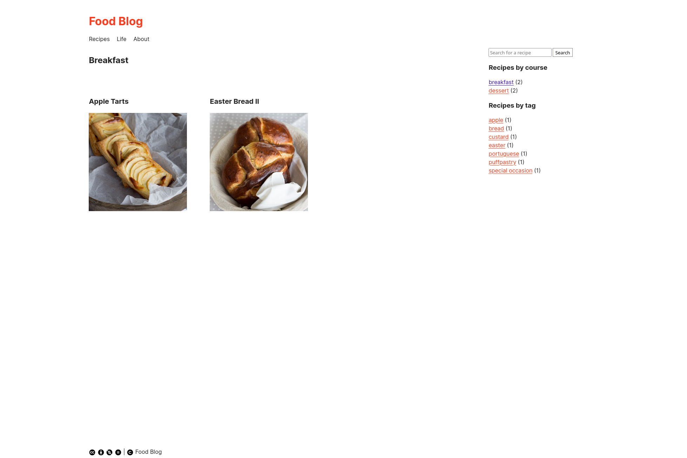

# Quiet Foodie

Clean and concise Hugo theme designed for creating a Food Blog. 

## Live demo

You can find a live demo on [github pages](https://paposeco.github.io/cleanhugotheme/), but for a full version you can check my own food blog [Punched Potatoes](https://punchedpotatoes.com).

## Main features

- No social media links or tracking of any kind. 
- If you choose to, you can create recipes with a [recipe schema markup](https://schema.org/Recipe) for better search engine results.
- By using tags and categories, recipes can easily be [browsed](https://www.punchedpotatoes.com/tags/special-occasion/) by the user.
- If you like to include a personal note on your recipes, you can hide it from your users by default, but still keep it in the blog post. 
- There's a Life section for personal posts and an About page.

## Getting started

### Installation

Create a new Hugo Site:
    hugo new site [path]

Inside the newly created directory in `[path]`, clone Quiet Foodie theme into the `/themes` directory:
    git clone https://github.com/paposeco/cleanhugotheme.git themes/quietfoodie

### Configuration

Add the following to your hugo.toml:
    theme = "quietfoodie"
    # your name
    authorname = "Author"
    
    sectionPagesMenu = "main"
        paginate = 3

    [markup.goldmark.renderer]
        unsafe = true

    [params]
        mainSections = ['Recipes']

    [taxonomies]
        tag = "tags"
        course = "courses"

    [outputs]
        home = ["HTML", "JSON", "RSS"]

    [module]
        [module.hugoVersion]
        min = "0.41.0"

    # change to false if you don't want to use recipe schema markup
    recipeSchema = true
    # if your baseurl is not the site root, set canonifyurls to true (if you're hosting on github pages, for example)
    canonifyURLs = "false"

If you would like to have a favicon, place it inside `[static/images]` and name it favicon.ico.

## Add content

### Blog structure

Inside the `[content]` directory create a file named _index.md with the following content:
    ---
    weight: 130
    --- 

Inside the `[content]` directory create a directory called `[recipes]`. Create a file named _index.md inside the `[recipes]` directory with the following content:
    ---
    title: "Recipes"
    weight: 130
    ---

Optionally, if you would like to have a Life section on your blog, create a directory called `[life]` inside the `[content]` directory. Create a _index.md file inside the directory with the following content: 
    ---
    title: "Life"
    weight: 140
    ---

Posts on the Life section will not show up on the frontpage.

For the About page, create a directory called `[about]` inside the `[content]` directory. Create and index.md file with the following frontmatter:
    ---
    title: "About"
    menu: "main"
    type: "singlepage"
    ---

Finish writing your about page as you please.

### Actual content

Now that your blog structure is set up, you can start creating posts. 
- To create a new recipe with recipe schema markup, type 
    hugo new content --kind recipeschema recipes/nameofrecipe.md
- To create a new recipe without markyp, type
    hugo new content recipes/nameofrecipe.md
- For a life post type
    hugo new content life/nameofpost.md

Place your images inside the `[static/images]` directory.

### Recipe schema markup

Check out the examples inside exampleSite for more details. By creating content using the archetypes as I described before, the recipe files created will be ready for you to fill them out.
